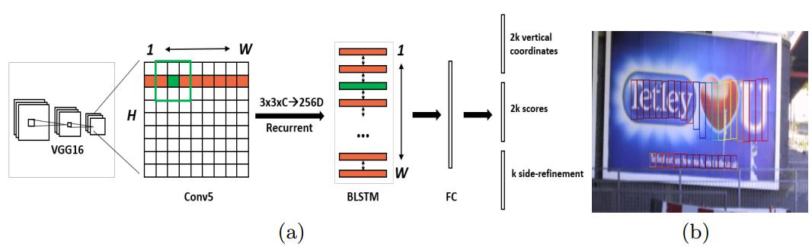

深度学习识别银行卡(一)————CTPN的配置
# CTPN简单了解
CTPN:Connectionist Text Proposal Network 即 场景文本检测
在文本识别中，CTPN有效利用了同一行文本不同字符之间的上下文，这是与一般物体检测不同的地方，同时作者认为预测文本的竖直位置比预测水平位置更为容易。
- CTPN使用了VGG-16前5个卷积层，得到feature map(W*H*C)
- 取3*3*C的窗口的特征，用于预测该位置k个anchor
- 将每一行的所有3*3*C的特征输入到RNN(BLSTM)中，得到W*256的输出
- 将RNN的W*256输入到512维的fc层
- fc层特征输入到三个分类或者回归层中,使用三个输出参数分别表示垂直位置,类别(是否为字符区域),水平位置
- 将分类得到的proposal合并,经过处理之后可得到连续的矩形区域

# 配置CTPN
[Github地址](https://github.com/eragonruan/text-detection-ctpn)
## 使用Ubuntu：
可以直接使用代码中的shell脚本对nms和bbox编译
```shell
cd utils/bbox
chmod +x make.sh
./make.sh
```
## 使用win10：
[参考网址](https://github.com/eragonruan/text-detection-ctpn/issues/264)
- 将 lib\utils\cython_nms.pyx 中第25行的 "np.int_t" 修改为 "np.intp_t"
- 将 gpu_nms.cpp中第2150行修改为
```c 
_nms((&(*__Pyx_BufPtrStrided1d(int *, __pyx_pybuffernd_keep.rcbuffer->pybuffer.buf, __pyx_t_10, __pyx_pybuffernd_keep.diminfo[0].strides))), (&__pyx_v_num_out), (&(*__Pyx_BufPtrStrided2d(__pyx_t_5numpy_float32_t *, __pyx_pybuffernd_sorted_dets.rcbuffer->pybuffer.buf, __pyx_t_12, __pyx_pybuffernd_sorted_dets.diminfo[0].strides, __pyx_t_13, __pyx_pybuffernd_sorted_dets.diminfo[1].strides))), __pyx_v_boxes_num, __pyx_v_boxes_dim, __pyx_t_14, __pyx_v_device_id);
```
- 编译C文件,在cmd中执行
```shell
cd your_dir\text-detection-ctpn-master\lib\utils
cython bbox.pyx
cython cython_nms.pyx
cython gpu_nms.pyx
```
- 新建setup_new.py文件
``` python
import numpy as np
from distutils.core import setup
from Cython.Build import cythonize
from distutils.extension import Extension
numpy_include = np.get_include()
setup(ext_modules=cythonize("bbox.pyx"),include_dirs=[numpy_include])
setup(ext_modules=cythonize("cython_nms.pyx"),include_dirs=[numpy_include])
```
- 编译.pyd文件 (Python编译版本必须与运行时版本一致)
```shell
python setup_new.py install
```
- 将"bbox.cpxx-win_xxxx.pyd" and "cython_nms.cpxx-win_xxxx.pyd" 复制到 "\text-detection-ctpn-master\lib\utils"
- 修改setup.py文件,将 cuda_libs 和 include_dirs 修改为你的路径值
``` python
import numpy as np
import os
PATH = os.environ.get('PATH')
print(PATH)
from distutils.spawn import spawn, find_executable
from setuptools import setup, find_packages, Extension
from setuptools.command.build_ext import build_ext
import sys
nvcc_compile_args = ['-O', '--ptxas-options=-v', '-arch=sm_35', '-c', '--compiler-options', '-fPIC', '--shared']
nvcc_compile_args = os.environ.get('NVCCFLAGS', '').split() + nvcc_compile_args
cuda_libs = [r'C:\Program Files\NVIDIA GPU Computing Toolkit\CUDA\v9.0\lib\x64\cublas', r"C:\Program Files\NVIDIA GPU Computing Toolkit\CUDA\v9.0\lib\x64\cudart"]
try:
    numpy_include = np.get_include()
except AttributeError:
    numpy_include = np.get_numpy_include()
cudamat_ext = Extension('gpu_nms',
                        sources=['gpu_nms.pyx', 'nms_kernel.cu'],
                        language='c++',
                        libraries=cuda_libs,
                        runtime_library_dirs=[],
                        extra_compile_args=nvcc_compile_args,
                        include_dirs = [numpy_include, r'C:\Program Files\NVIDIA GPU Computing Toolkit\CUDA\v9.0\include'])
class CUDA_build_ext(build_ext):
    """
    Custom build_ext command that compiles CUDA files.
    Note that all extension source files will be processed with this compiler.
    """
    def build_extensions(self):
        self.compiler.src_extensions.append('.cu')
        self.compiler.set_executable('compiler_so', 'nvcc')
        self.compiler.set_executable('linker_so', 'nvcc --shared')
        if hasattr(self.compiler, '_c_extensions'):
            self.compiler._c_extensions.append('.cu')  # needed for Windows
        self.compiler.spawn = self.spawn
        build_ext.build_extensions(self)
    def spawn(self, cmd, search_path=1, verbose=0, dry_run=0):
        """
        Perform any CUDA specific customizations before actually launching
        compile/link etc. commands.
        """
        if (sys.platform == 'darwin' and len(cmd) >= 2 and cmd[0] == 'nvcc' and
                cmd[1] == '--shared' and cmd.count('-arch') > 0):
            # Versions of distutils on OSX earlier than 2.7.9 inject
            # '-arch x86_64' which we need to strip while using nvcc for
            # linking
            while True:
                try:
                    index = cmd.index('-arch')
                    del cmd[index:index+2]
                except ValueError:
                    break
        elif self.compiler.compiler_type == 'msvc':
            is_cu_file = False
            for t in cmd:
                if t[-3:] == '.cu':
                    is_cu_file = True
                    break
            if is_cu_file:
                cmd[:1] = ['nvcc', '--compiler-bindir',
                           os.path.dirname(find_executable("cl.exe", PATH))
                           or cmd[0]]
                for idx, c in enumerate(cmd):
                    if c == '/c': cmd[idx] = '-c'
                    elif c == '/DLL': cmd[idx] = '--shared'
                    elif '-fPIC' in c: del cmd[idx]
                    elif c.startswith('/Tc'): cmd[idx] = c[3:]
                    elif c.startswith('/Fo'): cmd[idx:idx+1] = ['-o', c[3:]]
                    elif c.startswith('/LIBPATH:'): cmd[idx] = '-L' + c[9:]
                    elif c.startswith('/OUT:'): cmd[idx:idx+1] = ['-o', c[5:]]
                    elif c.startswith('/EXPORT:'): del cmd[idx]
                    elif c == 'cublas.lib': cmd[idx] = '-lcublas -lcudart.lib'
                if '--shared' in cmd:
                    pass_on = '--linker-options='
                    # we only need MSVCRT for a .dll, remove CMT if it sneaks in:
                    cmd.append('/NODEFAULTLIB:libcmt.lib')
                else:
                    pass_on = '--compiler-options='

                cmd.append('/NODEFAULTLIB:libcmt.lib')
                cmd = ([c for c in cmd if c[0] != '/'] +
                       [pass_on + ','.join(c for c in cmd if c[0] == '/')])
            else:
                cmd.append('/MT')
                pass
        spawn(cmd, search_path, verbose, dry_run)

setup(name="gpu_nms",
      description="Performs NMS computation on the GPU via CUDA",
      ext_modules=[cudamat_ext],
      cmdclass={'build_ext': CUDA_build_ext},
)
```
- 编译gpu_nms.pyd  打开VS2015 x64 本机工具命令提示符,如果没有，可以百度搜索安装一下
``` shell
cd your_dir\text-detection-ctpn-master\lib\utils
python setup.py build_ext --inplace
```
- 下图即为编译成功
- 

- 修改"ctpn\demo.py",将第24行的 "base_name = image_name.split('/')[-1]" 修改为 "base_name = image_name.split('\\')[-1]"
- 运行demo.py
``` shell
cd text-detection-ctpn-master
python ./ctpn/demo.py
```

* [CTPN Github](https://github.com/eragonruan/text-detection-ctpn)
* [Win10 安装参考网址](https://github.com/eragonruan/text-detection-ctpn/issues/264)
* [CTPN - 自然场景文本检测](https://blog.csdn.net/zchang81/article/details/78873347)